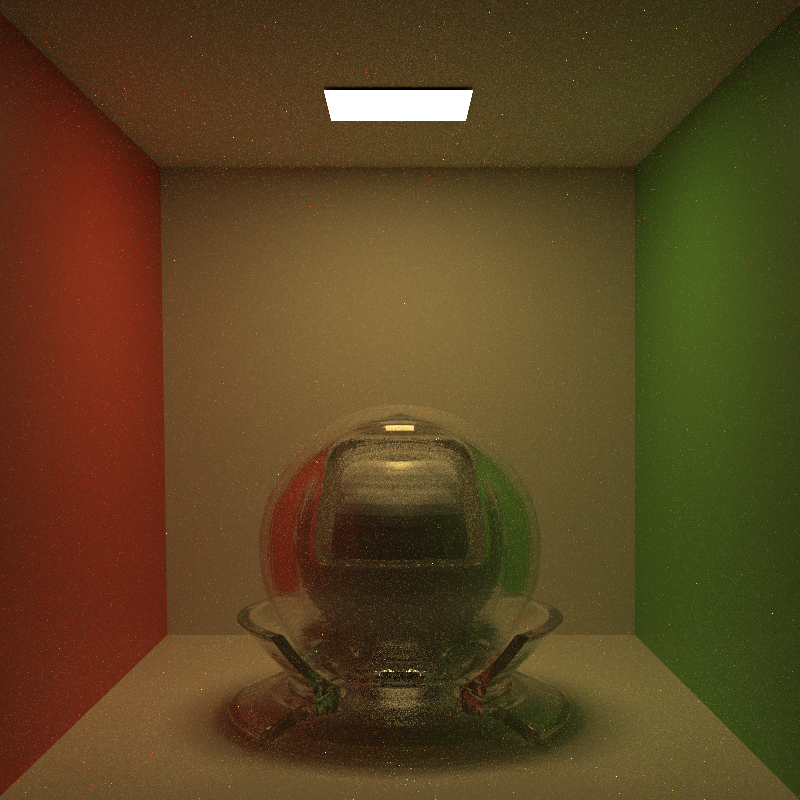
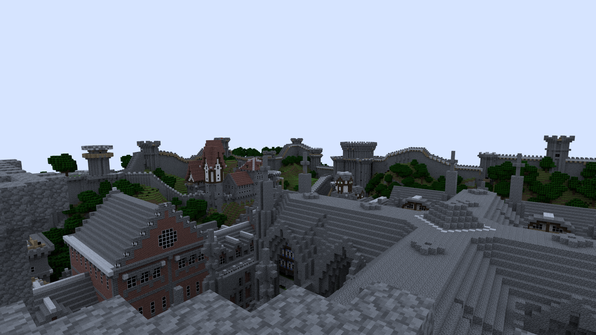
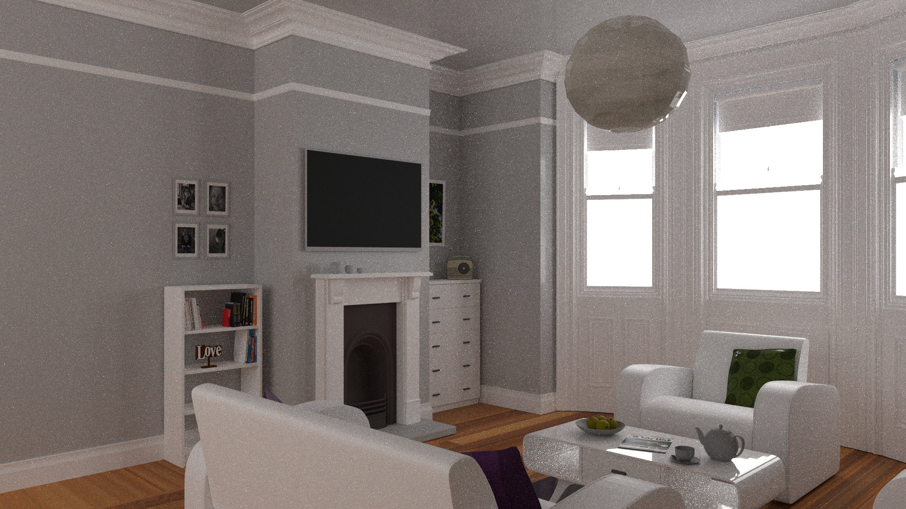

# Weekend Ray Tracer (C++ + Vulkan)

A minimal C++ rendering engine built using *Ray Tracing in One Weekend* as a base, with **Vulkan** used for real-time scene visualization.

---

## Preview



---

## Features

- Disney Principled material model with PDF support
- CPU-based path tracing
- Multiple Importance Sampling (MIS)
- Next Event Estimation (NEE)
- Basic camera system
- Anti-aliasing (stochastic sampling)
- Vulkan-based rendering pipeline for display

---

## More Examples

| Scene 1 | Scene 2 |
|--------|--------|
|  |  |

---

## Requirements

- C++17 compatible compiler (`g++`, `clang++`, or MSVC)
- Vulkan SDK (**1.4.341 recommended**)
- GPU with Vulkan support
- CMake (optional but recommended)

---

## Setup & Execution

### Prerequisites

First, install a compatible version of the Vulkan API on your machine.  
This project was developed using **Vulkan SDK 1.4.341**.

During installation, it is recommended to include the **GLM** library to simplify integration and development.

---

### Getting the Project

Clone or download the engine from the Github repository.

---

### Generate Build Files

Once the project is retrieved, generate the configuration files using CMake:

```bash
cmake -S . -B build
```

### Run the Engine

After generating the build files, simply run the provided script:

``run.bat``

## Troubleshooting

### Error: Cannot open include file: `glm/glm.hpp`

If you encounter this compilation error, it means the **GLM** library is not properly linked to your project.

#### Fix (Visual Studio)

1. Set the build configuration to **Release**
2. Open **Project Properties**
3. Navigate to:  
   `C/C++ → General → Additional Include Directories`
4. Add the path `C:\Render_Engine_v1\libs`
5. Apply changes

#### Rebuild

- Rebuild the entire solution:
  - `Build → Rebuild Solution`

After completing these steps, the project should compile successfully and `run.bat` should work as expected.
